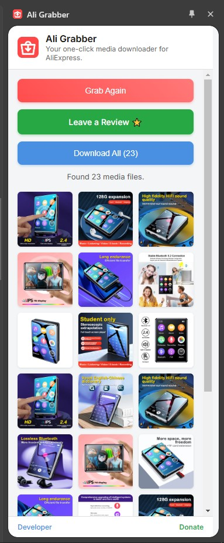

# Ali Grabber
A lightweight and convenient Chrome extension that adds a sidebar to your browser, allowing you to easily download all product images, videos, and description images from any AliExpress product page with a single click.

## 💯 Why Use This Extension?
When you need to save all the media from an AliExpress listing, downloading each file one by one is tedious and time-consuming. This extension solves that problem by providing a simple, one-click solution to grab every image and video from a product page. It's perfect for dropshippers, researchers, or anyone who needs to quickly collect product media.

### 📚 How to Use
1. __Navigate to a Product Page__: Go to any product page on `aliexpress.com` or `aliexpress.us`.
2. __Open the Sidebar__: Click the **"Ali Grabber"** icon in your Chrome toolbar to open the sidebar.

2. __Grab Media__: Click the **"Grab Media"** button. The extension will find all product images, description images, and videos.

3. __View and Download__:
    - Thumbnails of all found media will appear in the sidebar.
    - Click the download icon on any individual thumbnail to save that specific file.
    - Click the **"Download All"** button to save all the media at once in a convenient ZIP file.

 

### ⚙️ Key Features
- __Convenient Sidebar UI__: Works right alongside the product page without opening new tabs.
- __Comprehensive Grabbing__: Downloads main product images, description images, and product videos.
- __Individual & Bulk Downloads__: Save single files or get everything in a ZIP archive.
- __Video Thumbnail Support__: Displays video posters with a play icon for easy identification.
- __Smart & Resilient__: Built to handle different versions of AliExpress (.com and .us).
- __Lightweight & Fast__: Built with vanilla JavaScript for optimal performance.

### ✅ Permissions Explained
This extension requests a few permissions to provide its features. Here’s why each one is needed:
- `"sidePanel"`: Allows the extension to display its user interface in the browser's side panel.
- `"scripting"` & `"activeTab"`: Used to safely run the script that finds media URLs on the AliExpress page you are currently viewing.
- `"downloads"`: Required to save the images, videos, and ZIP files to your computer.
- `"tabs"`: Allows the UI to update correctly as you navigate between different tabs.

### ⭐ Enjoying the Extension? Leave a Review!
If you find this tool helpful, please consider leaving a 5-star review on the Chrome Web Store! Your feedback helps the extension grow and motivates future development.

You can rate it directly from the `"Leave a Review ⭐"` button that appears after grabbing media.

### 🔐 Privacy
This extension is built with your privacy in mind. It does not collect, store, or transmit any of your personal data. For more details, please read the full **[Privacy Policy](SECURITY.md)**.

### 💬 Need Help!
If you have any questions, require support, or have feedback, please feel free to get in touch.
- Developer: **Dizaraj Dey**
- Email: dizaraj@gmail.com
- Portfolio: dizaraj.github.io

### ❤️ Support the Project
**Feedback & Contributing:** Found a bug or have a feature request? Please open an issue on GitHub.
Contributions are welcome! Feel free to fork the repository and submit a pull request.

If you find it useful and would like to support its continued development, maintenance, and the creation of more helpful tools, please consider showing your appreciation. Your support is greatly valued!

